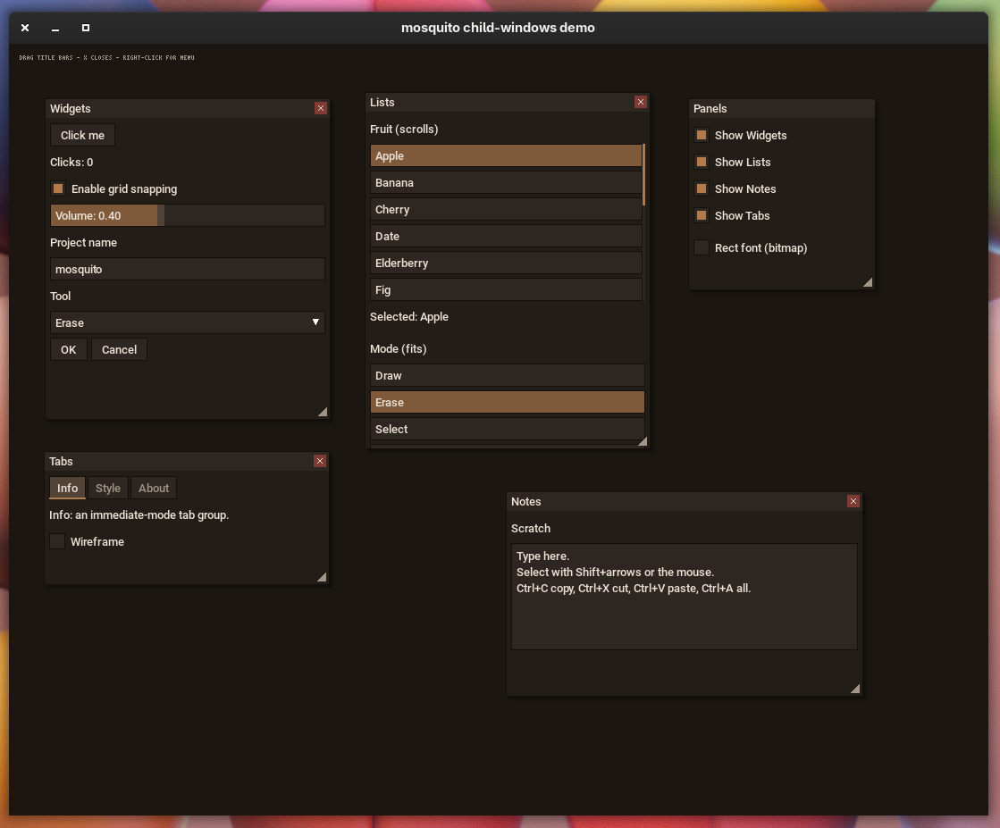

# mosquito


A tiny single-header immediate-mode GUI for **C + SDL2**. One `.h` file, no `.c`,
no build system, no widget tree. GIMP-style naming throughout: functions are
`msq_*`, types are `MsqFoo`, enum values are `MSQ_FOO`.

```
button · checkbox · slider · text input · textarea · list · dropdown
popup menu · tooltip · tabs · child windows
```

You need quick GUI for your AI project? Just throw it in! 


It is immediate-mode and imgui-flavoured: you re-declare the whole UI every
frame, but you also get draggable / resizable / closable **child windows** that
layer correctly, a multi-line **textarea** with selection and clipboard, and
**tab groups** — all in one readable header.

> Looking for the full manual? See **[Documentation.md](Documentation.md)**.

---

## Table of contents

1. [Design at a glance](#design-at-a-glance)
2. [Quick start](#quick-start)
3. [The frame loop](#the-frame-loop)
4. [Layout model](#layout-model)
5. [Widget reference](#widget-reference)
6. [Child windows](#child-windows)
7. [Widget identity (the important part)](#widget-identity-the-important-part)
8. [Fonts: TTF and the rect font](#fonts-ttf-and-the-rect-font)
9. [Theming](#theming)
10. [Compile-time configuration](#compile-time-configuration)
11. [Building](#building)
12. [Integrating into your own project](#integrating-into-your-own-project)
13. [Known limitations](#known-limitations)
14. [License](#license)

---



## Design at a glance

mosquito is **immediate mode**: you re-declare the entire UI every frame by
calling widget functions, and react to their return values right there. There
are no widget objects to allocate, retain, or free, and no callbacks to wire up.

The only state that persists across frames lives in a single opaque `MsqCtx`:

- which widget is **hot** (hovered), **active** (being pressed/dragged), and
  which holds keyboard **focus**;
- open popup menus and their positions;
- the tooltip hover timer;
- the text caret + selection;
- child-window geometry, z-order, and open/closed flags.

Everything else is recomputed from scratch each frame, which is what keeps the
API this small. A few ideas do most of the work:

| Idea | What it buys you |
|------|------------------|
| **Single context** | All retained state in one struct; create once, reuse forever. |
| **Source-order hashed IDs** | Widgets identify themselves from their label + call order, so you almost never assign IDs by hand. |
| **X-macro theme table** | The palette is declared once and expands into *both* the color enum and the default values — names and values can't drift apart. |
| **Auto stack layout** | Widgets flow down a panel (or across a row) automatically; you rarely pass coordinates. |
| **Deferred command buffer** | Child windows record their drawing and replay it sorted by z, so overlapping windows paint and receive input in the right order. |

---

## Quick start

```c
#define MSQ_IMPLEMENTATION   // do this in exactly ONE .c file
#include "mosquito.h"

int main(void) {
    SDL_Init(SDL_INIT_VIDEO);
    SDL_Window   *win = SDL_CreateWindow("app", 0, 0, 480, 400, SDL_WINDOW_SHOWN);
    SDL_Renderer *ren = SDL_CreateRenderer(win, -1, SDL_RENDERER_ACCELERATED);

    // pass a .ttf path for crisp text, or NULL to fall back to the bitmap font
    MsqCtx *ui = msq_create(ren, "/usr/share/fonts/.../DejaVuSans.ttf", 16);

    bool  snap   = true;
    float vol    = 0.4f;
    char  name[MSQ_TEXT_CAP] = "untitled";
    int   tool   = 0;
    const char *tools[] = { "Draw", "Erase", "Select", "Pan" };

    for (bool running = true; running; ) {
        SDL_Event e;
        msq_begin_frame(ui);
        while (SDL_PollEvent(&e)) {
            if (e.type == SDL_QUIT) running = false;
            msq_handle_event(ui, &e);
        }

        MsqColor bg = msq_color(MSQ_COL_WINDOW_BG);
        SDL_SetRenderDrawColor(ren, bg.r, bg.g, bg.b, bg.a);
        SDL_RenderClear(ren);

        msq_panel_begin(ui, 16, 16, 448);
            if (msq_button(ui, "Save")) { /* save */ }
            msq_tooltip(ui, "write the file to disk");

            msq_checkbox(ui, "Snap to grid", &snap);
            msq_slider(ui, "Volume", &vol, 0.f, 1.f);
            msq_text_input(ui, "Name", name, MSQ_TEXT_CAP);
            msq_dropdown(ui, "Tool", tools, 4, &tool);
        msq_panel_end(ui);

        msq_end_frame(ui);      // draws deferred layers (windows, popups, tooltips)
        SDL_RenderPresent(ren);
        SDL_Delay(16);
    }

    msq_destroy(ui);
    SDL_DestroyRenderer(ren);
    SDL_DestroyWindow(win);
    SDL_Quit();
}
```

Runnable demos: [`demo.c`](demo.c) (every widget), [`demo_list.c`](demo_list.c)
(the list), and [`child-windows-demo.c`](child-windows-demo.c) (child windows,
the textarea, tabs, and runtime font switching).

---

## The frame loop

Every frame follows the same three-phase shape:

```c
msq_begin_frame(ui);                       // 1. reset per-frame state
while (SDL_PollEvent(&e))
    msq_handle_event(ui, &e);              // 2. feed every SDL event in
// ... clear renderer, then declare widgets + windows ...
msq_end_frame(ui);                         // 3. flush windows + popups + tooltips
```

| Function | Purpose |
|----------|---------|
| `void msq_begin_frame(MsqCtx *)` | Clears the hot widget, resets the layout cursor, the per-frame id counter, and the window command buffer; computes which window is front-most under the cursor. Call first. |
| `void msq_handle_event(MsqCtx *, const SDL_Event *)` | Records mouse motion/buttons/wheel, text input, and the keys mosquito cares about (backspace, delete, arrows, home/end, enter, tab, and Ctrl+C/X/V/A). Call once per polled event. |
| `void msq_end_frame(MsqCtx *)` | Replays child windows in z-order, then draws popups and tooltips *above* everything, then consumes the frame's edge events. Call last, before `SDL_RenderPresent`. |

You still own the renderer: mosquito never clears the screen or presents for you.
Layering from bottom to top is: top-level (panel) widgets → child windows →
popups → tooltips.

---

## Layout model

Widgets are placed by an auto-advancing cursor instead of explicit rectangles.

```c
msq_panel_begin(ui, x, y, width);   // anchor a column at (x, y)
    msq_label(ui, "Settings");      // each widget stacks downward
    msq_button(ui, "OK");

    msq_row_begin(ui);              // switch to left-to-right flow
        msq_button(ui, "Apply");
        msq_button(ui, "Cancel");
    msq_row_end(ui);               // back to stacking down, below the row
msq_panel_end(ui);                 // strokes a border around the emitted area
```

| Function | Purpose |
|----------|---------|
| `msq_panel_begin(ctx, x, y, w)` | Start a panel; sets the anchor and the column width that full-width widgets (sliders, text inputs, lists, textareas, column-mode dropdowns) expand to. |
| `msq_panel_end(ctx)` | Strokes a border around everything emitted since `begin`. |
| `msq_row_begin(ctx)` / `msq_row_end(ctx)` | Flow the enclosed widgets horizontally; the cursor returns below the tallest widget in the row. |
| `msq_spacer(ctx, px)` | Insert `px` pixels of gap (horizontal inside a row, vertical otherwise). |
| `msq_label(ctx, text)` | Draw a line of static text. |

A **child window** is its own little panel: between `msq_window_begin` and
`msq_window_end` the same cursor lays widgets out inside the window body. See
[Child windows](#child-windows).

---

## Widget reference

All widgets take the context first and most take a `label`, which doubles as the
widget's identity seed (see [Widget identity](#widget-identity-the-important-part)).
This is a quick tour — **[Documentation.md](Documentation.md)** has the full
behaviour of each.

```c
bool msq_button   (MsqCtx*, const char *label);
bool msq_checkbox (MsqCtx*, const char *label, bool *value);
bool msq_slider   (MsqCtx*, const char *label, float *value, float min, float max);
bool msq_text_input(MsqCtx*, const char *label, char *buf, int cap);
bool msq_textarea (MsqCtx*, const char *label, char *buf, int cap, int visible_rows);
bool msq_list     (MsqCtx*, const char *label, const char *const *items,
                   int count, int *selected, int visible_rows);
bool msq_dropdown (MsqCtx*, const char *label, const char *const *items,
                   int count, int *selected);
bool msq_tabs     (MsqCtx*, const char *label, const char *const *tabs,
                   int count, int *selected);
void msq_tooltip  (MsqCtx*, const char *text);   // call right after a widget
```

Highlights of the newer widgets:

- **`msq_textarea`** — multi-line editor over a caller-owned buffer. Mouse +
  `Shift`-arrow selection, `Home`/`End`, up/down with column memory, vertical
  scroll, and the **system clipboard**: `Ctrl+C` copy, `Ctrl+X` cut, `Ctrl+V`
  paste, `Ctrl+A` select-all. Returns `true` when the text changed.
- **`msq_list`** — single-selection listbox, capped to `visible_rows` (≤0 shows
  all), wheel-scrolls with a thin scrollbar when it overflows.
- **`msq_tabs`** — a horizontal strip of tabs; the selected one gets an accent
  underline. Edits `*selected`; you switch your own content with `if`/`switch`.

```c
static const char *pages[] = { "Info", "Style", "About" };
msq_tabs(ui, NULL, pages, 3, &page);
if      (page == 0) { /* info widgets  */ }
else if (page == 1) { /* style widgets */ }
else                { /* about widgets */ }
```

The **popup menu** is opened by you (e.g. on right-click) and rendered each
frame:

```c
MsqId menu = msq_gen_id(ui, "canvas-context");      // stable id, once
const char *items[] = { "Cut", "Copy", "Paste" };
if (right_click) msq_popup_open(ui, menu, mx, my);  // in event handling
int pick;
if (msq_popup(ui, menu, items, 3, &pick)) handle(pick);   // every frame
```

---

## Child windows

imgui / microui-style windows that are draggable, resizable, closable, and
auto-layering. State (position, size, z-order, open flag) is keyed by the title
and kept in the context, so you just re-declare them every frame:

```c
bool show_inspector = true;

if (msq_window_begin(ui, "Inspector", 40, 60, 300, 220, &show_inspector)) {
    msq_label(ui, "Transform");
    msq_slider(ui, "X", &x, -100, 100);
    msq_textarea(ui, "Notes", notes, sizeof notes, 5);
    msq_window_end(ui);                 // only call end if begin returned true
}
```

- `(x, y, w, h)` is the **initial** placement, used only the first time a window
  with that title is seen. After that the user drags the **title bar** to move
  it and the **bottom-right grip** to resize it.
- Pass a `bool*` for `open` to get a working **close button** (the X sets
  `*open = false`); pass `NULL` for a window that can't be closed.
- The **top-most window under the cursor receives input**, so overlapping
  windows behave the way you expect; clicking a window raises it.
- Window content is **clipped to the body**, so nothing spills outside — even
  after the window is resized smaller.
- Title bars use the regular (TTF) font; the rest follows your font choice.

`msq_window_begin` returns `false` when the window is closed/hidden, and in that
case you must **not** call `msq_window_end` — the `if (...) { ...; end; }`
pattern above handles this for you.

---

## Widget identity (the important part)

Because there are no widget objects, mosquito tells two widgets apart across
frames by deriving an `MsqId` from an FNV-1a hash of three things:

1. its **label** string,
2. the current **id-stack salt** (from `msq_push_id`),
3. a **per-frame call counter** that increments on every widget.

The call counter means two buttons with the *same* label still get different
ids automatically, as long as they're called in a consistent order. That covers
most UIs with zero effort.

Where you **do** need to help is loops, where call order alone isn't enough to
keep an id stable as the list changes. Push a unique salt per iteration:

```c
for (int i = 0; i < n; i++) {
    msq_push_id(ui, i);          // disambiguate this iteration
    if (msq_button(ui, "Delete"))
        remove_item(i);
    msq_pop_id(ui);
}
```

| Function | Purpose |
|----------|---------|
| `msq_push_id(ctx, salt)` / `msq_pop_id(ctx)` | Push/pop an integer salt mixed into every id while on the stack (up to `MSQ_ID_STACK` deep). |
| `msq_gen_id(ctx, seed)` | A **frame-stable** id from a string seed only — no call-counter mixing. Use this for popup ids that must survive across frames. |

> Rule of thumb: use `msq_gen_id` for popups you open from event handlers;
> rely on automatic ids everywhere else; reach for `msq_push_id` only inside
> loops. Child-window titles are hashed the same stable way, so two windows must
> have distinct titles.

---

## Fonts: TTF and the rect font

mosquito ships with **two** fonts and lets you mix them:

- **TTF** (default) — smooth UTF-8 text via SDL2_ttf, from the font path you
  pass to `msq_create`.
- The **rect font** — a chunky, no-blur **3×5 bitmap font** that is *always*
  available, even with SDL2_ttf compiled in. It covers ASCII 32–90 (space
  through `Z`; lowercase is drawn as uppercase) and is ideal for genuinely tiny,
  crisp captions.

```c
void msq_set_font      (MsqCtx*, MsqFontKind kind);   // MSQ_FONT_TTF or MSQ_FONT_RECT
void msq_set_rect_scale(MsqCtx*, int scale);          // pixel size of the rect font

// standalone, no MsqCtx (like the other draw_* helpers):
void msq_rect_text  (SDL_Renderer*, int x, int y, const char *s, int scale, MsqColor c);
int  msq_rect_text_w(const char *s, int scale);
int  msq_rect_text_h(int scale);
```

If you pass `NULL` as the font path (or build with `MSQ_NO_TTF`), widgets simply
use the rect font instead of drawing blank — so text always shows up.

---

## Theming

The palette is defined once via an X-macro table that expands into both the
`MsqColorSlot` enum and the default color array, so the two can never get out of
sync. Each entry is a packed `0xRRGGBBAA` value:

```c
#define MSQ_THEME_COLORS(_)                    \
  _(MSQ_COL_WINDOW_BG,     0x1B1612FF)         \
  _(MSQ_COL_WIDGET_BG,     0x2E2620FF)         \
  _(MSQ_COL_ACCENT,        0xB07A4CFF)         \
  /* ... */
```

Slots: `MSQ_COL_WINDOW_BG`, `MSQ_COL_WIDGET_BG`, `MSQ_COL_WIDGET_HOT`,
`MSQ_COL_WIDGET_ACTIVE`, `MSQ_COL_ACCENT`, `MSQ_COL_ACCENT_DIM`, `MSQ_COL_TEXT`,
`MSQ_COL_TEXT_DIM`, `MSQ_COL_BORDER`, `MSQ_COL_TOOLTIP_BG`, `MSQ_COL_POPUP_BG`,
and the child-window slots `MSQ_COL_TITLEBAR`, `MSQ_COL_TITLEBAR_ACTIVE`,
`MSQ_COL_CLOSE`, `MSQ_COL_CLOSE_HOT`, `MSQ_COL_WINDOW_BODY`.

Read a default, or override a slot on a live context:

```c
MsqColor accent = msq_color(MSQ_COL_ACCENT);                    // default lookup
msq_set_color(ui, MSQ_COL_ACCENT, (MsqColor){255, 120, 60, 255}); // override
```

To re-skin the whole library without touching the source, `#define` your own
`MSQ_THEME_COLORS(...)` before the include that carries `MSQ_IMPLEMENTATION`.

---

## Compile-time configuration

Define these **before** the include that defines `MSQ_IMPLEMENTATION`:

| Macro | Default | Meaning |
|-------|---------|---------|
| `MSQ_TEXT_CAP` | `256` | Suggested capacity for user-owned text buffers. |
| `MSQ_MAX_POPUP_ITEMS` | `64` | Upper bound used when reasoning about popup sizes. |
| `MSQ_ID_STACK` | `32` | Maximum `msq_push_id` nesting depth. |
| `MSQ_MAX_WINDOWS` | `32` | Maximum number of distinct child windows. |
| `MSQ_MAX_DRAW_CMDS` | `2048` | Capacity of the per-frame window command buffer. |
| `MSQ_DRAW_STR_ARENA` | `8192` | Bytes of per-frame string storage for recorded text. |
| `MSQ_NO_TTF` | *unset* | Drop the SDL2_ttf dependency and use the rect font everywhere. |

Internal tunables (edit in the implementation block if you want to change them):
`MSQ_TOOLTIP_DELAY_MS` (500), `MSQ_PAD` (6), `MSQ_ROW_H` (26), `MSQ_GAP` (4),
`MSQ_TITLEBAR_H` (22), `MSQ_RESIZE_GRIP` (16), `MSQ_WIN_MIN_W` (90),
`MSQ_WIN_MIN_H` (56).

---

## Building

Install the dev packages, then use the helper script:

```sh
sudo apt install libsdl2-dev libsdl2-ttf-dev   # Debian/Ubuntu

./build.sh          # build the demos with SDL2_ttf (crisp text)
./build.sh nottf    # build with -DMSQ_NO_TTF (rect font only, no SDL2_ttf)
./demo  ./demo_list  ./child_windows_demo
```

Manual invocation:

```sh
gcc -Wall -Wextra -O2 child-windows-demo.c -o app $(sdl2-config --cflags --libs) -lSDL2_ttf -lm
# or, without SDL2_ttf:
gcc -Wall -Wextra -O2 -DMSQ_NO_TTF child-windows-demo.c -o app $(sdl2-config --cflags --libs) -lm
```

All variants compile cleanly under `-Wall -Wextra`.

---

## Integrating into your own project

1. Drop `mosquito.h` into your include path.
2. In **exactly one** `.c` file:
   ```c
   #define MSQ_IMPLEMENTATION
   #include "mosquito.h"
   ```
3. In every other file that uses the API, just `#include "mosquito.h"` (no
   define) to pull in the declarations.
4. Link `SDL2` and `SDL2_ttf` (drop `SDL2_ttf` if you build with `MSQ_NO_TTF`),
   plus `-lm`.

mosquito draws through an `SDL_Renderer` you already own, so it composes with any
other SDL2 rendering you do in the same frame — declare your UI after your scene
so it lands on top.

---

## Known limitations

- No word-wrap in the textarea (lines break only on `\n`); horizontal overflow
  is clipped. Backspace/Delete work on bytes, so editing multi-byte UTF-8 mid
  glyph is imperfect.
- The rect font is uppercase-only and covers ASCII 32–90.
- Rows don't auto-wrap, and there's no general scrolling container (lists and
  textareas scroll themselves).
- Popups are stored in a small fixed ring (8 simultaneous).
- Top-level (panel) widgets and child windows share the screen; if you overlap
  them, keep interactive top-level widgets out from under your windows.
- Right-to-left text and complex shaping are out of scope.

These are deliberate: mosquito aims to stay a single small header you can read in
one sitting.

---

## License

MIT / DAMIR SIJAKOVIC (C) 2026
